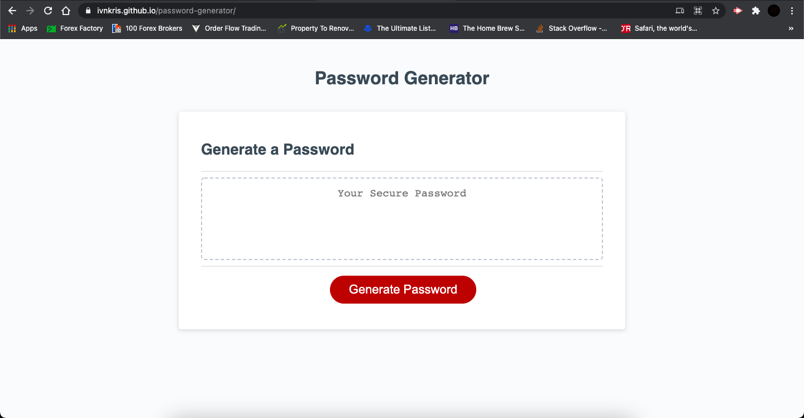
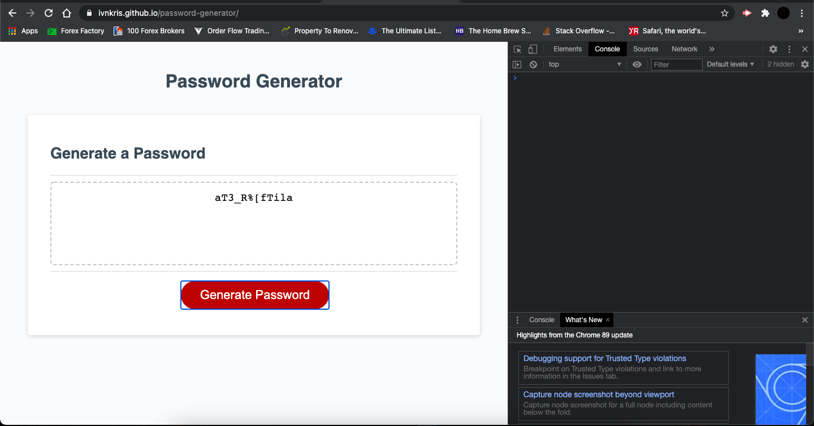

# Password Generator

## Description

In this project I have created a random password generator that prompts the user to give a password length between 8 and 128 characters and select if they want to include lowercase and uppercase characters, numbers and special characters. The algorithm then generates a random password based on the criteria and displays it as text on the screen.

## What I have done

- [x] Added a prompt for the length of the password to be stored in a variable
- [x] Added validation to check if the password length is between 8 and 128 characters
- [x] Added confirmation to ask the user if they want to include lowercase, uppercase, numeric and special characters and stored the results in boolean variables
- [x] Added validation to check if at least one character type was selected
- [x] Added a function to push at least one random character of each selected character type into the final password array
- [x] Added a function to concatenate charset arrays into one array for selected characters
- [x] Added a function to loop through password length and push random characters from concatenated array into password array
- [x] Joined password array into a string to be presented as text on the user's screen
- [x] Re-set variables to make the password generator re-usable

## Link to Github repository

https://github.com/ivnkris/password-generator

## Link to deployed application

https://ivnkris.github.io/password-generator/

## Screenshots

